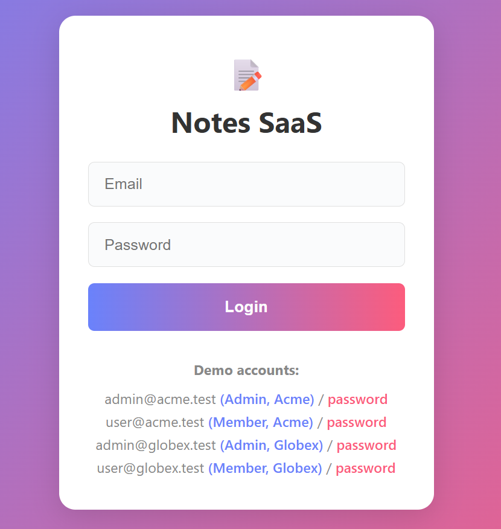
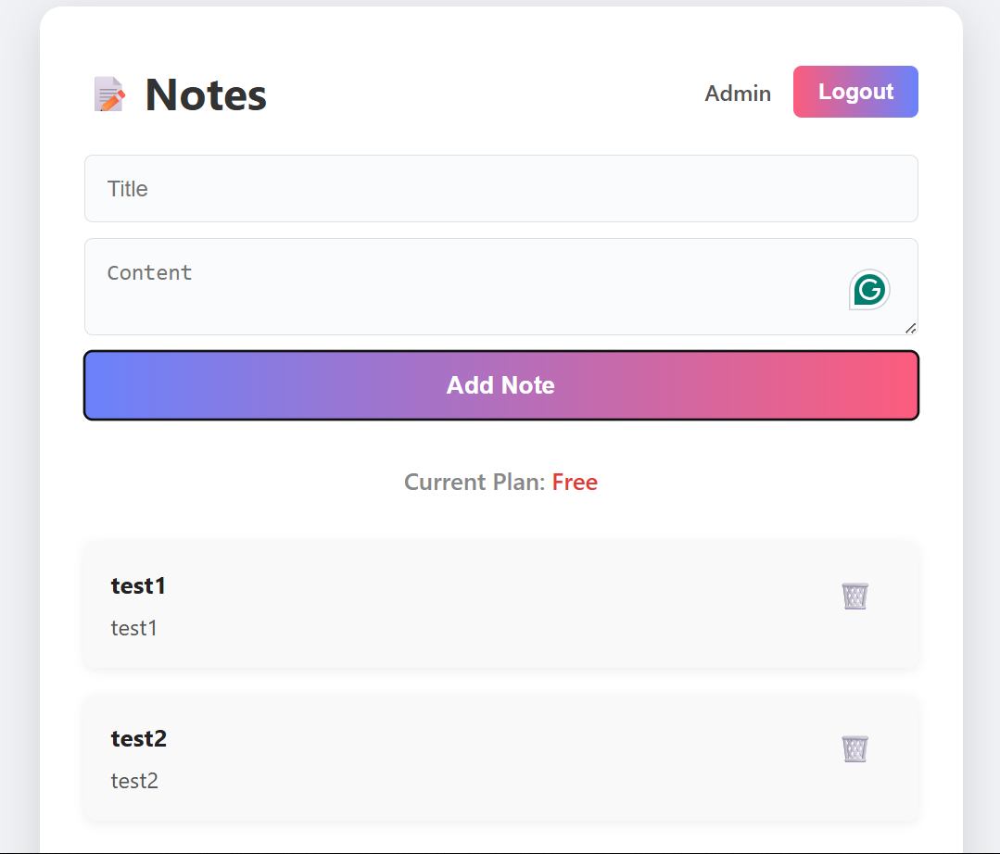
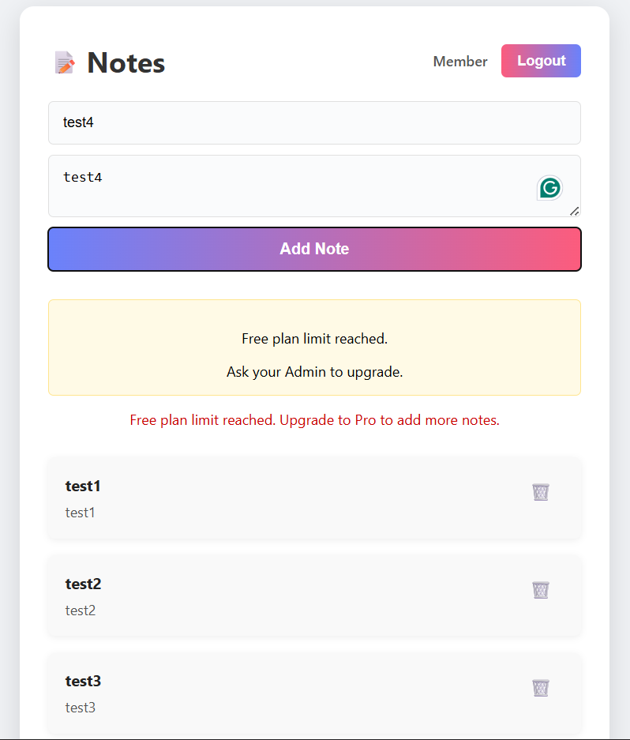
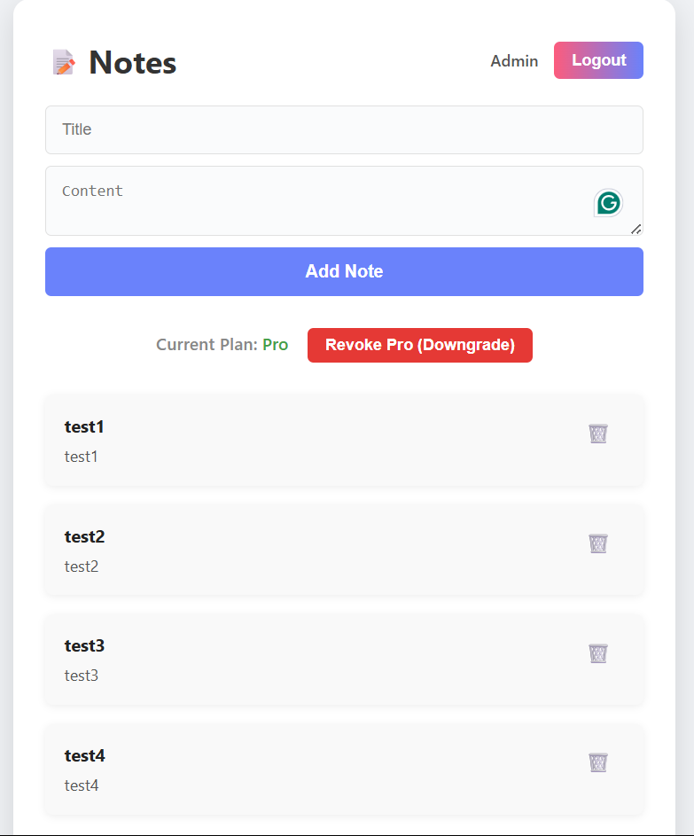

# SaaS Notes App

A modern, multi-tenant SaaS Notes Application with strict tenant isolation, role-based access, and subscription-based feature gating.

---

## Features

- **Multi-Tenancy:** Each company (tenant) has its own isolated notes and users.
- **Role-Based Access:**
  - **Admin:** Can manage users and upgrade/downgrade the subscription plan.
  - **Member:** Can create, read, update, and delete notes.
- **Subscription Gating:**
  - **Free Plan:** Up to 3 notes per tenant.
  - **Pro Plan:** Unlimited notes. Admins can upgrade or downgrade at any time.
- **Authentication:** Secure login for each user.
- **Modern UI:** Responsive, clean, and demo-friendly interface.

---

## Demo Screenshots

### Login Page

### Notes Page (Free Plan)

### Upgrade to Pro Message

### Notes Page (Pro Plan)

---

## Highlights

- **Strict Tenant Isolation:** No data leaks between tenants.
- **Role Enforcement:** Only Admins can upgrade/downgrade plans.
- **Subscription Logic:** Free plan limits, Pro plan unlocks unlimited notes.
- **Modern, Responsive UI:** Built with Next.js and React.
- **Fast, Clean Code:** Used GitHub Copilot for debugging, rapid iteration, and code quality.

---

## Test Accounts

- **Acme (Admin):** admin@acme.test / password
- **Acme (Member):** user@acme.test / password
- **Globex (Admin):** admin@globex.test / password
- **Globex (Member):** user@globex.test / password

---

*For a live demo or code walkthrough, just ask!*
